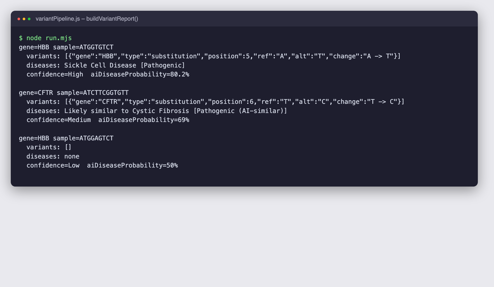
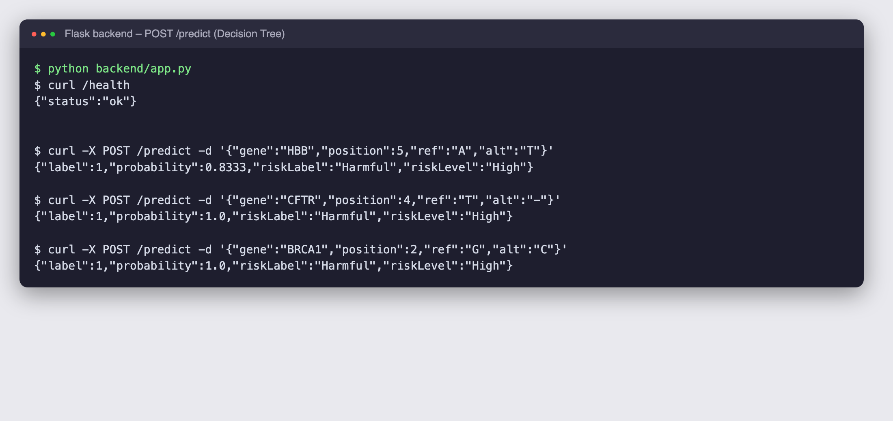
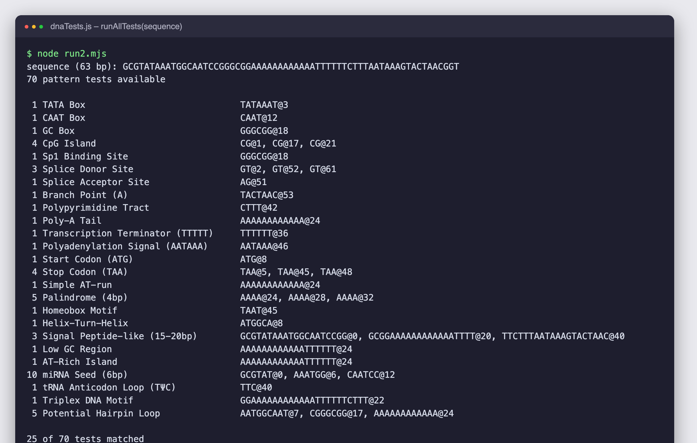
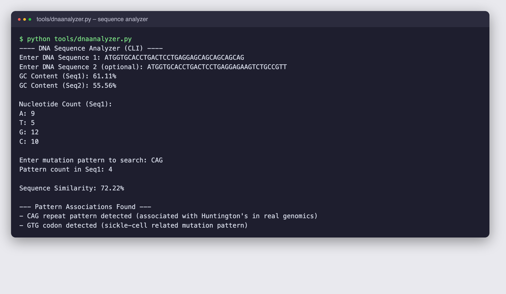

# DNA Sequence Analysis and Genetic Disease Prediction System

A web platform for analysing DNA sequences and flagging **possible genetic disease associations**. Users paste a sequence or upload a FASTA file, choose the gene to compare against, and receive a report of the variants found, the diseases they are linked to, and a combined risk score from a curated variant database plus a machine-learning model. Administrators get a dashboard over every user and every result.

> This repository documents the project (description, design, screenshots). The source code lives in a private repository, `DNA-Prediction-System-code`. Educational tool; **not for clinical or diagnostic use**.

## Screenshots

Output from the real code paths (the web UI sits behind Firebase sign-in, so these show the engines it calls):

**Variant pipeline** (`buildVariantReport`): finds the change against the reference gene and annotates it.



**Prediction API** (Flask, Decision Tree): the model scores each variant as Harmful or Benign with a probability.



**Pattern tests** (70 regular-expression motif tests run on every sequence):



**Command-line analyzer** (`tools/dnaanalyzer.py`): GC content, base counts, pattern search, similarity.



## How it works

```
 FASTA / pasted DNA
        |  validate (A,T,G,C only) + normalise
        v
 1. 70 motif tests ------------------------------> pattern summary
 2. align to reference gene -> list substitutions
 3. look each variant up in the variant database -> disease + significance
        |                      \
        |                       +--> closest "AI-similar" match when no exact hit
        v
 4. for each hit: POST /predict -> Decision Tree -> Harmful/Benign + probability
 5. final risk = average(database weight, model probability)
        v
 saved to Firestore -> shown to the user, listed for the admin
```

- **Reference library**: HBB, CFTR, BRCA1, PAH, HEXA, DMD, F8 and HTT short reference sequences.
- **Variant database**: known variants such as HBB position 5 A to T (Sickle Cell Disease), CFTR T to C (Cystic Fibrosis), BRCA1 A to G (Breast Cancer risk), each with a significance (Pathogenic, Likely pathogenic, Uncertain).
- **Confidence** (High/Medium/Low) and an **AI disease probability** are derived from how many pathogenic and likely-pathogenic matches are found (logistic function).
- **ML model**: `backend/train_model.py` trains a scikit-learn `DecisionTreeClassifier` (max depth 6) on `gene_mutation_data.csv` (92 labelled variants) using gene id, position, reference base and alternate base; `backend/app.py` serves it as `POST /predict` and `GET /health`.
- **Accounts and roles**: Firebase Authentication; each user has a `user` or `admin` role in Firestore. Users see only their own results; admins see all results and users and can promote or demote roles.
- **Front end**: React 18 with Tailwind CSS, Framer Motion and Recharts charts.

## Tech stack
React, Tailwind CSS, Recharts, Framer Motion, Firebase Authentication + Firestore, Python Flask, scikit-learn, pandas, joblib.

## Limitations
Reference sequences and the variant list are small educational samples, and the model is trained on a tiny dataset; results illustrate the method only.
